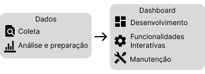

# Dashboard de Disciplinas
Este projeto, desenvolvido como uma das atividades do PET-CC, visa desenvolver um dashboard interativo para monitorar o desempenho dos alunos nas disciplinas do curso de Ciência da Computação da Universidade Federal de Santa Maria (UFSM). O dashboard utiliza dados fornecidos pela secretaria do curso para fornecer insights sobre tendências acadêmicas e auxiliar os alunos na seleção de disciplinas de maneira mais informada.

## Etapas do Projeto

    

### 1. Coleta de Dados
Os dados foram obtidos a partir das tabelas fornecidas pela secretaria do curso, contendo informações sobre o desempenho dos alunos em cada disciplina ao longo do tempo.

### 2. Análise e Preparação de Dados
Realizamos uma análise preliminar para identificar possíveis inconsistências ou valores ausentes nos dados. As tabelas foram unificadas em um único conjunto de dados consolidado e cruzadas com uma tabela contendo os nomes das disciplinas e os semestres recomendados para cursá-las.

### 3. Desenvolvimento do Dashboard
Utilizamos o software Power BI para desenvolver o dashboard, escolhido devido à sua capacidade de criar visualizações interativas e dinâmicas. Foram criados gráficos para apresentar as métricas-chave de forma clara e compreensível.

### 4. Implementação de Funcionalidades Interativas
O dashboard foi projetado com funcionalidades interativas para aprimorar a experiência do usuário, como filtros e seletores para personalizar a visualização dos dados.

    

### 5. Manutenção e Melhorias Contínuas
O desenvolvimento do dashboard é um processo contínuo, com melhorias regulares com base no feedback dos usuários e nas mudanças nas necessidades e requisitos do curso.

## Visualizações do Dashboard
### Consulta de disciplina específica

### Visão geral do curso

## Como Replicar
É necessária uma planilha contendo colunas específicas

## Links
[Programa de Educação Tutorial do curso de Ciência da Computação da UFSM](https://www.ufsm.br/pet/ciencia-da-computacao "Site do PET-CC da UFSM")
[Ciência da Computação da UFSM](https://www.ufsm.br/cursos/graduacao/santa-maria/ciencia-da-computacao "Site do curso de Ciência da Computação da UFSM")